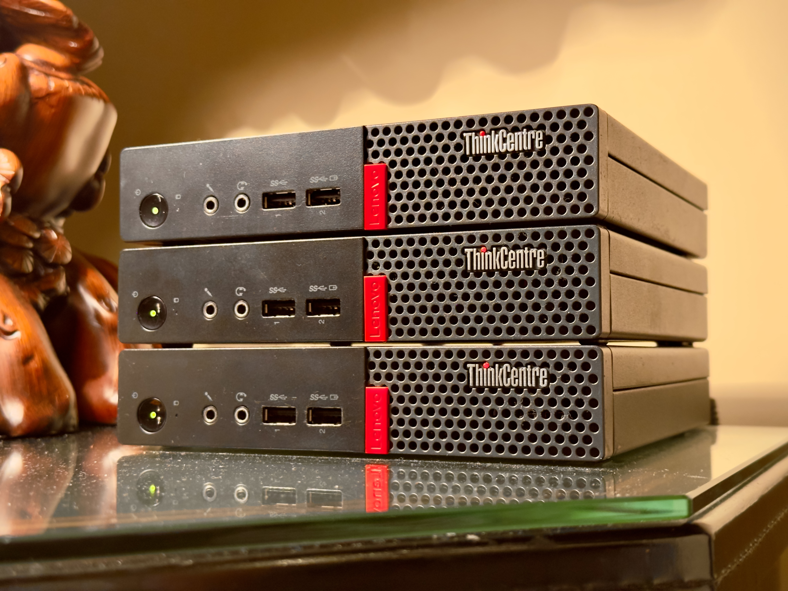

<p align="center">

<br>
<a href="https://nixos.org"></a>
</p>

## Overview

- These are the Nix configurations for my homelab servers, desktop, and M1
  MacBook Air
- Nix flakes handle upstream dependencies
- [home-manager](https://github.com/nix-community/home-manager) manages my
  dotfiles
- [nix-darwin](https://github.com/LnL7/nix-darwin) manages my MacBook
- [sops-nix](https://github.com/Mic92/sops-nix) manages secrets such as my
  Tailscale authentication key
- `justfile` contains useful aliases for many frequent and atrociously long
  `nix` commands
- Modular architecture promotes readability for me and copy-and-paste-ability
  for you

<p align="center">

<br>
Homelab hardware: ThinkCenter M710q Tiny, Intel i5-7500T and 8GB RAM
</p>

## Getting set up 

> [!IMPORTANT] 
> You'll need to run this script as sudo or have sudo permissions.

```
bash -c "$(curl -fsSL https://raw.githubusercontent.com/eh8/chenglab/main/install.sh)"
```

On macOS, this script will install `nix` using the [Determinate Systems Nix
installer](https://zero-to-nix.com/start/install) and prompt you to install my
configuration.

On Linux, this script will prepare your system for NixOS by partitioning drives
and
mounting them.

> [!WARNING] 
> NixOS configurations are tailored for my devices. You'll need to create your
> own config in the `machines/` folder before you install.

## Useful commands

Install `just` to access the simple aliases below

### Locally deploy changes

```
just deploy macos
```

```
just deploy MACHINE
```

### Remote deployment

To remotely deploy `MACHINE`, which has an IP address of `10.0.10.2`

```
just deploy MACHINE 10.0.10.2
```

### Edit secrets

Make sure each machine's public key is listed as entry in `.sops.yaml`. To
modify `secrets/secrets.yaml`:

```
just edit-secrets
```

## Important caveats

### Changing user passwords

To modify user password, first generate a hash

```
echo "password" | mkpasswd -m SHA-512 -s
```

Then run `just secrets` to replace the existing decrypted hash with the one that
you just generated. If you use a password manager, sure to update the new
password as necessary.

### Changing SSH keys

Make sure you update the public key as it appears across the repository.

### Installation source

Make sure the Determinate Nix installer one-liner in `install.sh` is consistent
with how it appears on the official website.

## To-do

1. [Wireless remote
   unlocking](https://discourse.nixos.org/t/wireless-connection-within-initrd/38317/13)

## Frequently used resources

- [Search NixOS options](https://search.nixos.org/options)
- [Home Manager Option
  Search](https://mipmip.github.io/home-manager-option-search/)
- [Darwin Configuration
  Options](https://daiderd.com/nix-darwin/manual/index.html)

## Helpful references

- [An outstanding beginner friendly introduction to NixOS and
  flakes](https://nixos-and-flakes.thiscute.world/)
- [Conditional
  implementation](https://nixos.wiki/wiki/Extend_NixOS#Conditional_Implementation)
- [Error when using lib.mkIf and lib.mkMerge to set configuration based on
  hostname](https://stackoverflow.com/questions/77527439/error-when-using-lib-mkif-and-lib-mkmerge-to-set-configuration-based-on-hostname)
- [Handling Secrets in NixOS: An
  Overview](https://lgug2z.com/articles/handling-secrets-in-nixos-an-overview/)
- [NixOS ❄: tmpfs as root](https://elis.nu/blog/2020/05/nixos-tmpfs-as-root)
- [NixOS on Hetzner
  Dedicated](https://mhu.dev/posts/2024-01-06-nixos-on-hetzner)
- [Setting up Nix on macOS](https://nixcademy.com/2024/01/15/nix-on-macos/)
- [Users.users.<name>.packages vs home-manager
  packages](https://discourse.nixos.org/t/users-users-name-packages-vs-home-manager-packages/22240)
- [Declaratively manage dock via
  nix](https://github.com/dustinlyons/nixos-config/blob/8a14e1f0da074b3f9060e8c822164d922bfeec29/modules/darwin/home-manager.nix#L74)